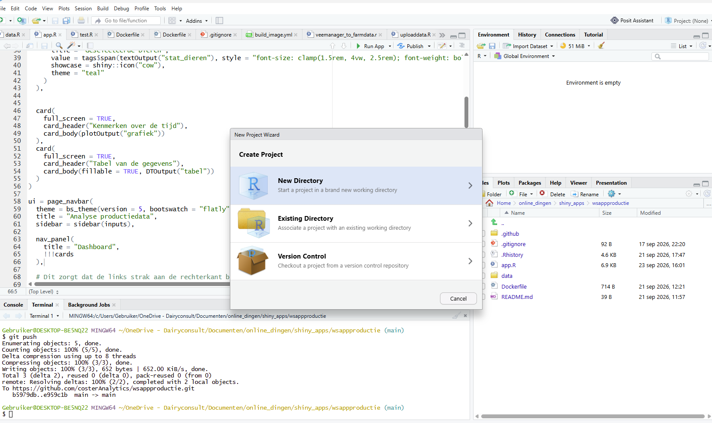
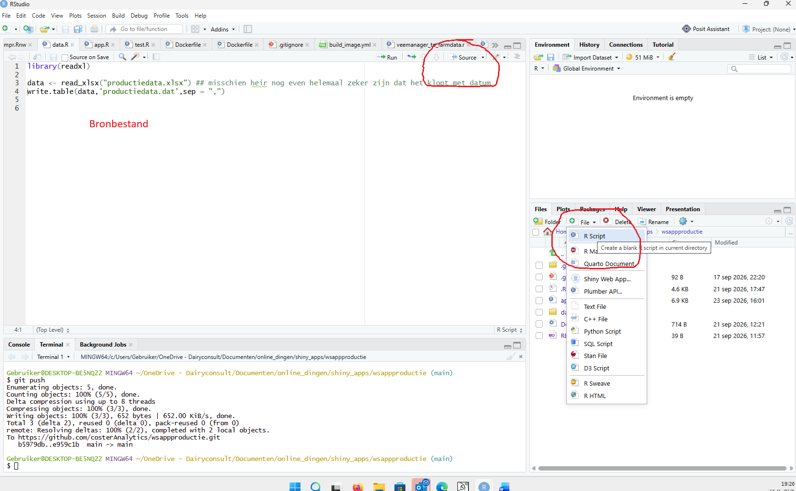

## Wat is R

R is een open-source programmeertaal en softwareomgeving voor statistische berekeningen, datamanipulatie en datavisualisatie.

We gebruiken R, maar werken in RStudio.

## RStudio


## Projecten

Het is verstandig om in projecten te werken. In dit geval maken we project `rworkshop`. Bij het aanmaken van dit project maakt RStudio een nieuwe map `rworkshop` aan, en plaatst daar het bestand `rworkshop.Rproj` in. Als je dit bestand aanklikt, opent RStudio meteen in de juiste werkmap.

{width="80%" height="auto"}

## Werkmap

De werkmap is de map waarin R als eerste zoekt naar bestanden. Werk je in een project, dan is de werkmap automatisch goed ingesteld.

Werk je zonder project, dan stel je de werkmap in met `Session/Set Working Directory/To Source File Location` (of een andere keus).

{width="80%" height="auto"}

## Bronbestanden

Je geeft R opdrachten in de vorm van code. Deze code kun je in de console intypen, maar het is verstandiger om code in een bronbestand te schrijven. Maak hiervoor een nieuw `.R` bestand aan in je werkmap. In dit bestand schrijf je R code, en R kan het bestand vervolgens uitvoeren.

- Voer één regel of een selectie uit met `Ctrl + Enter`
- Regels die beginnen met `#` zijn *commentaar*: R slaat ze over



## Basisbegrippen in R

- R is *case sensitive*: hoofdletters en kleine letters maken uit
- R werkt met *objecten*. We maken objecten met de `<-` operator, en kunnen daarna met de objecten werken

::: {.codewindow .r chrome="windows"}
code.R
```{r}
#| label: een
# Rekenen met getallen
a <- 1
b <- 2
totaal <- a + b
totaal
half <- a / 2
half
e <- a * b + totaal
e

# Werken met tekst
naam <- 'Albart'
achternaam <- 'Coster'
vnaam <- paste(naam, achternaam)
vnaam
```
:::

## Typen objecten

Objecten hebben een type. De belangrijkste zijn `numeric`, `character`, `logical` en `factor`. Met `class()` zie je het type.

::: {.codewindow .r chrome="windows"}
code.R
```{r}
#| label: typen
class(totaal)
class(vnaam)

# logical: TRUE of FALSE, vaak het resultaat van een vergelijking
groot <- totaal > 2
groot
class(groot)

# factor: tekst met een vast aantal categorieën
ras <- factor(c('HF', 'Jersey', 'HF'))
ras
levels(ras)

# NA betekent: ontbrekende waarde
geen <- NA
is.na(geen)
```
:::

## Datastructuren in R

- De vorige objecten bevatten één element
- In R kunnen we ook objecten maken met meerdere elementen. Hier behandelen we `vectoren` en `data.frames`

::: {.codewindow .r chrome="windows"}
code.R
```{r}
#| label: twee
productie <- c(30, 30, 40, 50)
productie
dieren <- c('dier1', 'dier2', 'dier3', 'dier4')
dieren

df1 <- data.frame(dieren = dieren, productie = productie)
df1

df1[1, 1]           # rij 1, kolom 1
df1$productie       # een hele kolom
df1$dieren[1]       # eerste element van een kolom
```
:::

## Selecteren uit vectoren en data.frames

Met `[ ]` selecteer je elementen, op positie of met een voorwaarde. Dit gebruiken we later veel om data te filteren in Shiny.

::: {.codewindow .r chrome="windows"}
code.R
```{r}
#| label: selecteren
productie[2]                    # tweede element
productie[productie > 35]       # elementen groter dan 35

df1[df1$productie > 35, ]       # rijen waar productie > 35
nrow(df1)                       # aantal rijen
```
:::

## Functies in R

In R worden operaties uitgevoerd met `operators` (zoals `+` en `-`) en `functies` (zoals `sum()` en `mean()`). Je kunt ook zelf functies maken.

::: {.codewindow .r chrome="windows"}
code.R
```{r}
#| label: drie
x <- 1 + 2
y <- x - 2

som <- sum(x, y)
gem <- mean(c(x, y, som))
gem

# Zelf een functie maken
efunctie <- function(n = 100, min = 0, max = 1){
  rnum <- runif(n, min = min, max = max)
  gemiddelde <- mean(rnum)
  stdev <- sd(rnum)
  c(gemiddelde = gemiddelde, sd = stdev)
}

set.seed(123)   # zorgt dat iedereen dezelfde 'toevallige' getallen krijgt
efunctie()
efunctie(1000, 0, 1000)
```
:::

## Hulp vragen

Weet je niet hoe een functie werkt? Vraag de helppagina op:

::: {.codewindow .r chrome="windows"}
code.R
```{r}
#| label: help
#| eval: false
?mean
help(mean)
```
:::

De helppagina verschijnt in RStudio rechtsonder, in het tabblad *Help*.

## Packages

R wordt uitgebreid met *packages*. Een package installeer je één keer, en laad je in elke sessie waarin je het gebruikt:


::: {.codewindow .r chrome="windows"}
code.R
```{r}
#| label: packages
#| eval: false
install.packages("shiny")   # één keer: package installeren
library(shiny)              # elke sessie: package laden
```
:::

In deze workshop gebruiken we onder andere het package `shiny`.

## Opdrachten

1. Maak object `lft` met je leeftijd
2. Maak object `naam` met je naam en `achternaam` met je achternaam
3. Bereken hoeveel maanden (of dagen!!) je hebt geleefd
   - *Tip:* `Sys.Date()` geeft de datum van vandaag, `as.Date("1980-05-17")` maakt een datum
4. Maak een vector met namen, `namen`
5. Maak er ook een met (geschatte) leeftijden, `lfts`
6. Maak `data.frame` `mensen` met twee kolommen, `namen` en `leeftijden`
   - *Tip:* de kolomnaam mag anders zijn dan de naam van de vector: `leeftijden = lfts`
7. Wie in `mensen` is ouder dan 30?

## Uitwerkingen

::: {.content-password name="basis-uitwerkingen-rshiny"}
```{r}
#| label: uitwerkingen
lft <- 45
naam <- 'Jan'
achternaam <- 'Jansen'

lft * 12                                           # maanden, ongeveer
as.numeric(Sys.Date() - as.Date("1980-05-17"))     # dagen

namen <- c('Anna', 'Piet', 'Kees')
lfts <- c(25, 34, 52)
mensen <- data.frame(namen = namen, leeftijden = lfts)
mensen

mensen[mensen$leeftijden > 30, ]
```
:::
