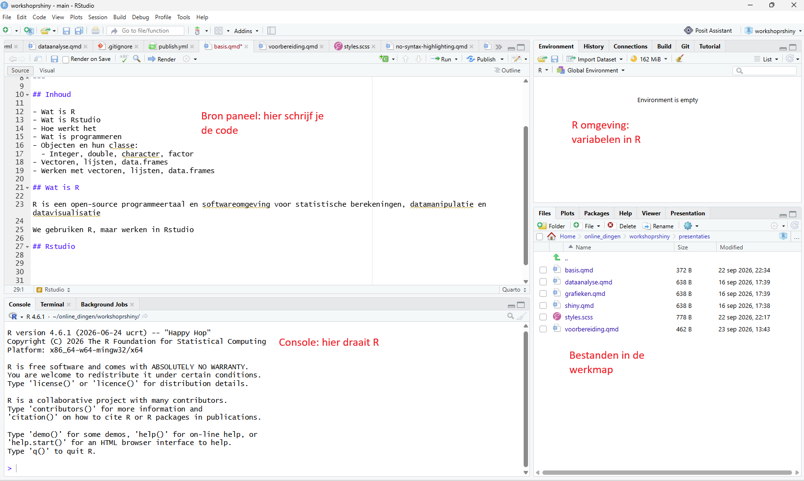
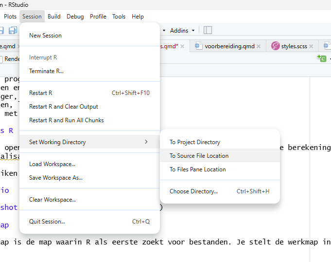

## Wat is R

R is een open-source programmeertaal en softwareomgeving voor statistische berekeningen, datamanipulatie en datavisualisatie

We gebruiken R, maar werken in Rstudio

## Rstudio



## Werkmap en bronbestanden

De werkmap is de map waarin R als eerste zoekt voor bestanden. Je stelt de werkmap in met de knop `Session/Set Working Directory/To Source File location` (of een andere keus)


{ width=80% }

## Projecten

Het is verstandig om in projecten te werken. In dit geval maken we project `rworkshop`. Bij aanmaken van dit project maakt R een nieuwe map genaamd `rworkshop` aan, en plaatst daar het bestand `rworkshop.Rproj` in. Bij aanklikken van dit bestand opent Rstudio in de juiste werkmap

R werkt voor je als je opdrachten die code ingeeft. Deze code kan in de console ingegeven worden, maar het is verstandiger om code in een bronbestand te schrijven. Maak hiervoor een nieuw .R bestand aan in je werkmap. In dit bestand kun je R code schrijven en R kan het bestand vervolgens uitvoeren

## Basisbegrippen in R

- R is *case sensitive*, hoofdletters en kleine letters maken uit
- R werkt met *objecten*. We maken objecten met de `<-` operator, en kunnen met de objecten werken
- Objecten hebben een type: `numeric`, `character`, `factor`:

::: {.codewindow .r chrome="windows"}
code.R
```{r}
#| label: een
#| echo: true
#| output: true
#| warning: false
a <- 1
b <- 2
c <- a + b
c
d <- a/2
d
e <- a*b + c
e
naam <- 'Albart'
achternaam <- 'Coster'
vnaam <- paste(naam,achternaam)
vnaam
geen <- NA
```
:::

## Datastructuren in R

- Vorige objecten bevatten één element
- In R kunnen we objecten maken met meerdere elementen. Hier behandelen we `vectoren` en `data.frames`:

```{r}
#| label: twee
#| echo: true
#| output: true
#| warning: false

productie <- c(30,30,40,50)
productie
dieren <- c('dier1','dier2','dier3','dier4')
dieren

df1 <- data.frame(dieren = dieren,productie = productie)
df1

df1[1,1]
df1$productie
df1$dier[1]

```

## Functies in R

In R worden operaties uitgevoerd met code, `operators` en `functies`

```{r}
#| label: drie
#| echo: true
#| output: true
#| warning: false

a <- 1 + 2
b <- a - 2

c <- sum(a,b)
d <- mean(c(a,b,c))

efunctie <- function(n = 100,min = 0,max = 1){
  rnum <- runif(n,min = min,max = max)
  mn <- mean(rnum)
  sd <- sd(rnum)
  c(mn,sd)
}
efunctie()
efunctie(1000,0,1000)

```

## Opdrachten

1. Maak object `lft` met je leeftijd
2. Maak object `naam` met je naam en `achternaam` met je achternaam
3. Bereken hoeveel maanden (of dagen!!) je hebt geleefd
4. Maak een vector met namen, `namen`
5. Maak er ook een met (geschatte) leeftijden, `lfts`
6. Maak `data.frame` `mensen` met twee kolommen, `namen` en `leeftijden`


